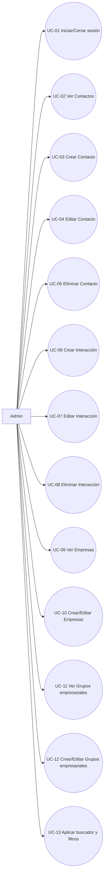
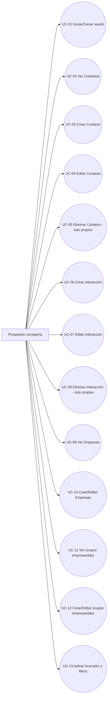
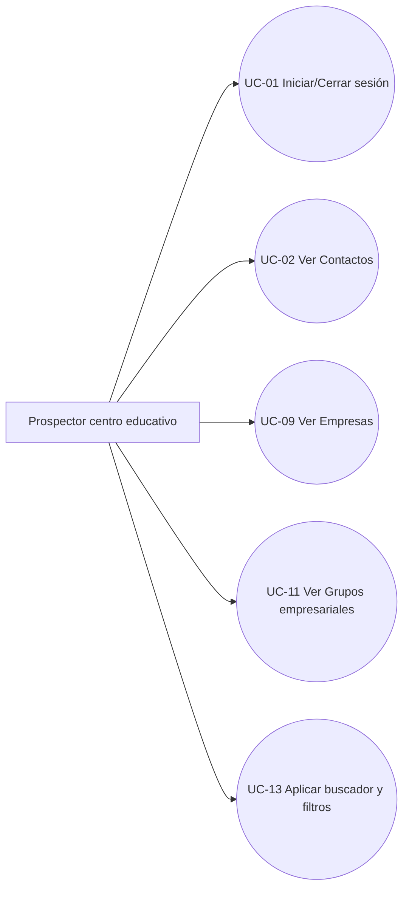
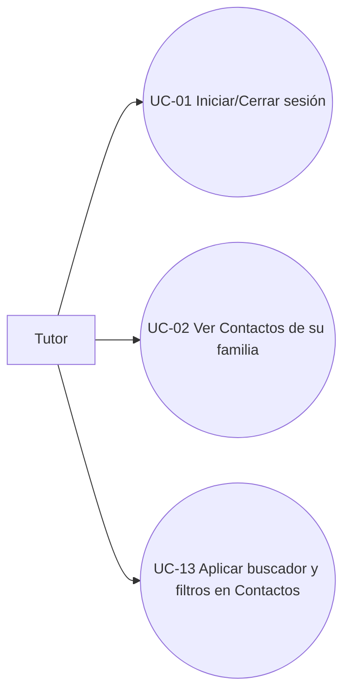
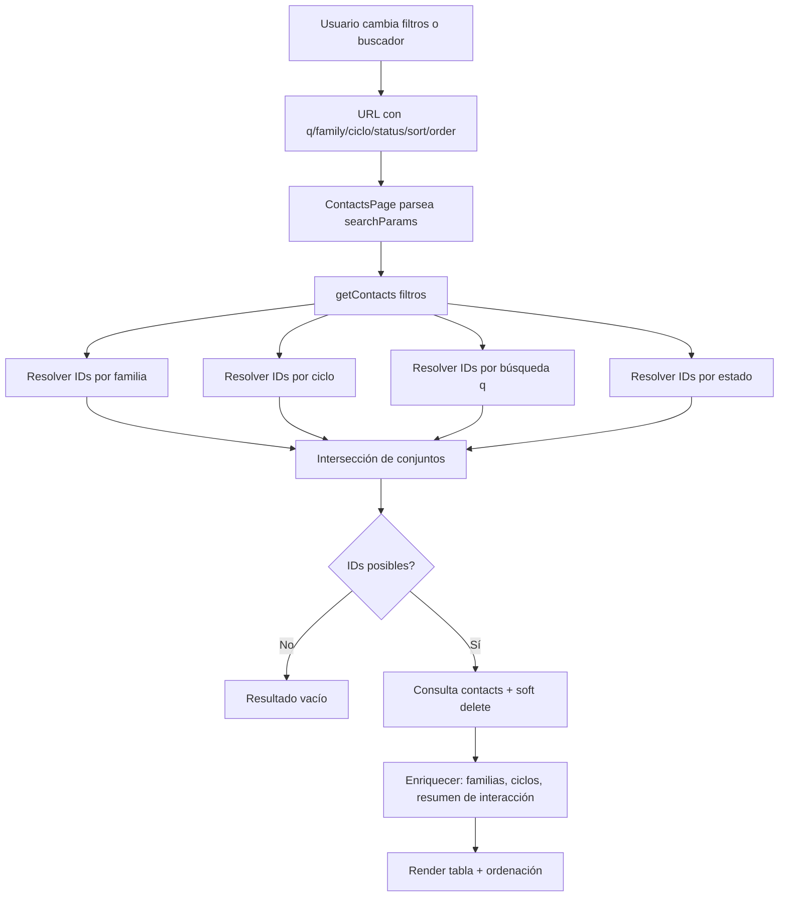
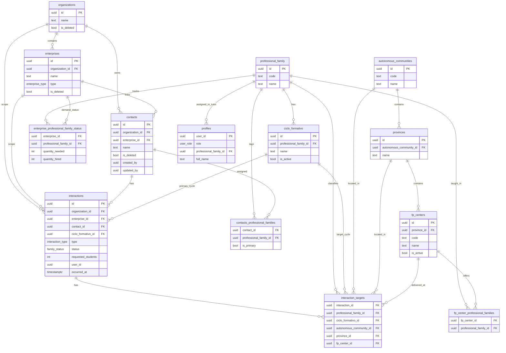

# Documentación funcional de Prospectors App

Fecha de elaboración: 2026-03-30

## 1) Diagramas de casos de uso por rol

### 1.1 Admin

### 1.2 Prospector de la consejería

### 1.3 Prospector del centro educativo

### 1.4 Tutor

### Notas de permiso por actor

- Admin:
  - Puede ver, crear, editar y eliminar en todo el sistema.
- Prospector de la consejería:
  - Puede ver, crear y editar todo.
  - Solo puede eliminar registros creados por sí mismo (`created_by` / `user_id`).
- Prospector del centro educativo:
  - Solo lectura.
- Tutor:
  - Solo lectura en Contactos.
  - Solo ve datos de su familia profesional.
  - No puede acceder a pestañas de Empresas ni Grupos empresariales.

### Casos de uso separados

#### UC-01 Iniciar/Cerrar sesión

- Actores: Admin, Prospector consejería, Prospector centro, Tutor.
- Objetivo: autenticar el acceso y finalizar la sesión de forma explícita.
- Precondición: credenciales válidas con dominio `@gobiernodecanarias.org`.
- Flujo principal: login exitoso, carga de rol y permisos, navegación a funcionalidades permitidas.
- Postcondición: sesión activa con contexto de permisos o sesión cerrada.

#### UC-02 Ver Contactos

- Actores: Admin, Prospector consejería, Prospector centro, Tutor.
- Objetivo: consultar el listado de contactos y navegar a su detalle.
- Precondición: usuario autenticado.
- Flujo principal: carga de contactos con filtros/ordenación y acceso al detalle por contacto.
- Restricciones: el Tutor solo visualiza datos de su familia profesional.

#### UC-03 Crear Contacto

- Actores: Admin, Prospector consejería.
- Objetivo: registrar un nuevo contacto.
- Precondición: permiso `canWrite`.
- Flujo principal: completar formulario, validar consistencia empresa-grupo, insertar contacto, revalidar lista.
- Restricciones: Prospector centro y Tutor no pueden crear.

#### UC-04 Editar Contacto

- Actores: Admin, Prospector consejería.
- Objetivo: actualizar datos de un contacto existente.
- Precondición: permiso `canWrite`.
- Flujo principal: abrir modal, validar datos, actualizar contacto, refrescar detalle y listado.
- Restricciones: Prospector centro y Tutor no pueden editar.

#### UC-05 Eliminar Contacto

- Actores: Admin, Prospector consejería.
- Objetivo: eliminar un contacto.
- Precondición: permiso de borrado.
- Flujo principal: validar propiedad del registro, marcar `is_deleted = true`, redirigir a listado.
- Restricciones: Prospector consejería solo elimina registros creados por sí mismo.

#### UC-06 Crear Interacción

- Actores: Admin, Prospector consejería.
- Objetivo: registrar una interacción asociada a un contacto.
- Precondición: permiso `canWrite` y contacto válido.
- Flujo principal: seleccionar tipo/estado/targets, validar coherencia y duplicados de interacción abierta, insertar interacción y targets.
- Restricciones: Tutor y Prospector centro no pueden crear.

#### UC-07 Editar Interacción

- Actores: Admin, Prospector consejería.
- Objetivo: modificar una interacción existente.
- Precondición: permiso `canWrite`.
- Flujo principal: editar campos, revalidar reglas de targets/estado, actualizar interacción y reemplazar targets.
- Restricciones: Tutor y Prospector centro no pueden editar.

#### UC-08 Eliminar Interacción

- Actores: Admin, Prospector consejería.
- Objetivo: eliminar una interacción.
- Precondición: permiso de borrado.
- Flujo principal: verificar autoría (`interactions.user_id`), borrar registro, revalidar vistas.
- Restricciones: Prospector consejería solo elimina interacciones creadas por sí mismo.

#### UC-09 Ver Empresas

- Actores: Admin, Prospector consejería, Prospector centro.
- Objetivo: consultar listado y detalle de empresas.
- Precondición: usuario autenticado.
- Flujo principal: buscar por nombre (`q`), abrir detalle de empresa y navegar a su grupo empresarial.
- Restricciones: Tutor no accede a esta pestaña.

#### UC-10 Crear/Editar Empresas

- Actores: Admin, Prospector consejería.
- Objetivo: mantener datos de empresas.
- Precondición: permiso `canWrite`.
- Flujo principal: alta/edición de campos, validación de organización asociada, guardado y revalidación.
- Restricciones: Prospector centro y Tutor no pueden crear/editar.

#### UC-11 Ver Grupos empresariales

- Actores: Admin, Prospector consejería, Prospector centro.
- Objetivo: consultar listado y detalle de grupos empresariales.
- Precondición: usuario autenticado.
- Flujo principal: buscar por nombre (`q`) y consultar detalle.
- Restricciones: Tutor no accede a esta pestaña.

#### UC-12 Crear/Editar Grupos empresariales

- Actores: Admin, Prospector consejería.
- Objetivo: mantener entidades organizacionales.
- Precondición: permiso `canWrite`.
- Flujo principal: alta/edición de datos del grupo, guardado y revalidación.
- Restricciones: Prospector centro y Tutor no pueden crear/editar.

#### UC-13 Aplicar buscador y filtros

- Actores: todos los actores con acceso a la vista correspondiente.
- Objetivo: acotar resultados en listados.
- Precondición: estar en pantalla con buscador/filtros.
- Flujo principal: actualizar parámetros en URL, resolver subconjuntos de IDs por criterio, intersectar resultados y renderizar.
- Restricciones: en Contactos, Tutor usa familia profesional bloqueada.

## 2) Funcionamiento de las 3 tabs principales

La navegación principal tiene tres pestañas:

- Grupos empresariales (`/organizations`)
- Empresas (`/enterprise`)
- Contactos (`/contacts`)

### 2.1 Grupos empresariales

Objetivo:
- Mantener el catálogo de organizaciones (grupo empresarial) y acceder a su detalle.

Comportamiento:
- Lista con buscador por nombre (`q`).
- Alta disponible para usuarios con permiso de escritura (`canWrite`).
- Usuarios `tutor` son redirigidos a Contactos y no pueden entrar en esta pestaña.

### 2.2 Empresas

Objetivo:
- Mantener empresas vinculadas opcionalmente a un grupo empresarial.

Comportamiento:
- Lista con buscador por nombre (`q`).
- Alta disponible para `canWrite`.
- Desde la tabla se navega al detalle de empresa y al grupo empresarial relacionado.
- Usuarios `tutor` también son redirigidos a Contactos.

### 2.3 Contactos

Objetivo:
- Vista principal de prospección: listado de contactos, estado de interacciones y acceso al detalle.

Comportamiento:
- Muestra resumen por contacto:
  - Familias profesionales relacionadas.
  - Ciclos con interacción.
  - Alumnos solicitados acumulados.
  - Última interacción y estado.
- Permite ordenar por:
  - Nombre, empresa, grupo empresarial, alumnos solicitados y última interacción.
- Permite crear contacto si hay `canWrite`.
- Para `tutor`:
  - Se fija/limita la familia profesional a la asignada al usuario.
  - Solo ve contactos con información relacionada a su familia.

## 3) Tipos de usuario (según guía existente)

Fuente: `docs/tipos-de-usuario.md`.

### Regla de identidad

- Formato de usuario obligatorio: `[nombre]@gobiernodecanarias.org`.

### Matriz de capacidades

| Tipo de usuario | Ver | Crear | Editar | Eliminar | Alcance |
|---|---|---|---|---|---|
| Admin | Sí | Sí | Sí | Sí | Todo |
| Prospector consejería | Sí | Sí | Sí | Solo propios | Todo |
| Prospector centro educativo | Sí | No | No | No | Todo (solo lectura) |
| Tutor | Sí | No | No | No | Solo Contactos de su familia |

### Aplicación práctica en la app

- `canWrite` habilita creación/edición.
- `canDeleteAny` (admin) permite eliminar cualquier registro.
- `canDeleteOwn` (prospector consejería) restringe borrado a registros cuyo creador coincide con el usuario.
- `tutor`:
  - Solo navega en Contactos.
  - No puede crear/editar/borrar.
  - Solo consulta datos filtrados por su familia profesional.

## 3.1) Requisitos del sistema

### Tabla de requisitos funcionales

| ID | Requisito funcional | Prioridad | Criterio de aceptación |
|---|---|---|---|
| RF-01 | El sistema debe permitir iniciar y cerrar sesión con cuentas del dominio gobiernodecanarias.org. | Alta | El usuario autenticado accede a su vista según rol y puede cerrar sesión desde la barra superior. |
| RF-02 | El sistema debe aplicar control de acceso por rol (admin, prospector consejería, prospector centro, tutor). | Alta | Cada rol solo visualiza y ejecuta acciones permitidas en navegación y operaciones. |
| RF-03 | El sistema debe mostrar las 3 pestañas principales: Grupos empresariales, Empresas y Contactos. | Alta | Un usuario no tutor puede navegar a las tres pestañas desde la barra principal. |
| RF-04 | El rol tutor debe tener acceso exclusivo a Contactos. | Alta | Si un tutor intenta entrar en Empresas o Grupos empresariales, es redirigido a Contactos. |
| RF-05 | El sistema debe permitir crear, editar y eliminar contactos según permisos. | Alta | Usuarios con escritura crean/editar; eliminación restringida por reglas de rol y autoría. |
| RF-06 | El sistema debe permitir crear, editar y eliminar interacciones desde el detalle de contacto. | Alta | El usuario autorizado ejecuta operaciones y ve resultados actualizados en detalle y listado. |
| RF-07 | El sistema debe impedir interacciones abiertas duplicadas para el mismo contacto y ciclo. | Alta | Al intentar guardar una duplicada, se muestra error y no se persiste el registro. |
| RF-08 | El sistema debe validar consistencia entre familia, ciclo, comunidad, provincia y centro FP en targets. | Alta | Si hay incoherencia de datos, la operación se rechaza con mensaje de validación. |
| RF-09 | El sistema debe permitir búsqueda y filtros en Contactos por texto, familia, ciclo y estado. | Alta | La URL conserva parámetros y la tabla refleja solo los registros que cumplen todos los filtros activos. |
| RF-10 | El sistema debe permitir búsqueda por nombre en Empresas y Grupos empresariales. | Media | Al introducir q, el listado se reduce a coincidencias por nombre. |
| RF-11 | El sistema debe permitir ordenación en Contactos por campos principales. | Media | Al pulsar cabeceras ordenables cambia el orden asc/desc y se refleja en la URL. |
| RF-12 | El sistema debe mantener trazabilidad de autoría y fechas en entidades clave. | Alta | Campos created_by, updated_by, user_id y timestamps quedan informados para auditoría funcional. |

### Tabla de requisitos no funcionales

| ID | Requisito no funcional | Categoría | Criterio de aceptación |
|---|---|---|---|
| RNF-01 | La aplicación debe responder con navegación y renderizado fluido en las vistas principales. | Rendimiento | Las páginas principales cargan sin bloqueos perceptibles en uso normal de oficina. |
| RNF-02 | Las operaciones de creación/edición/borrado deben mantener consistencia transaccional de datos de interacción y targets. | Integridad | No quedan registros huérfanos ni combinaciones inválidas tras operaciones exitosas. |
| RNF-03 | El sistema debe proteger acciones sensibles mediante autorización en servidor, no solo en interfaz. | Seguridad | Acciones server-side rechazan operaciones cuando el rol no tiene permiso. |
| RNF-04 | El sistema debe preservar trazabilidad funcional de cambios y eliminaciones permitidas por autoría. | Auditabilidad | Se puede identificar creador/actualizador y aplicar regla de borrado de registros propios. |
| RNF-05 | El sistema debe operar con borrado lógico donde aplique para conservar histórico de negocio. | Mantenibilidad de datos | Contactos, empresas y organizaciones no desaparecen físicamente en eliminaciones funcionales estándar. |
| RNF-06 | La solución debe ser mantenible con separación por dominio (contacts, enterprises, organizations, fp-centers). | Mantenibilidad | Lógica reutilizable concentrada en módulos de lib y acciones acotadas por feature. |
| RNF-07 | La interfaz debe ser usable en escritorio y móvil, manteniendo legibilidad y acciones principales accesibles. | Usabilidad | Tablas, formularios y filtros se usan sin pérdida crítica de funcionalidad en ambos formatos. |
| RNF-08 | El sistema debe mostrar mensajes de error comprensibles cuando falle una validación de negocio. | UX/Calidad | El usuario recibe mensajes claros y accionables al no poder guardar cambios. |
| RNF-09 | El sistema debe escalar horizontalmente para soportar crecimiento de usuarios concurrentes y volumen de registros sin degradación crítica. | Escalabilidad | Con 10x de datos en contactos/interacciones y mayor concurrencia, la aplicación mantiene tiempos de respuesta estables en listados y operaciones clave mediante paginación, filtros selectivos e índices en campos de búsqueda/relación. |

## 4) Sistema de interacciones: creación, edición y borrado

Las interacciones se gestionan en el detalle de contacto (`/contacts/[id]`).

### 4.1 Creación de interacción

Flujo funcional:

1. Usuario abre modal "Nueva interacción".
2. Selecciona:
   - Tipo (`call`, `visit`, `email`, `meeting`, `other`).
   - Estado (`family_status`).
   - Fecha/hora.
   - Notas.
   - Targets (familia/ciclo y opcionalmente comunidad/provincia/centro FP).
3. Backend valida:
   - Permiso de escritura.
   - Existencia y consistencia de familia/ciclo/centro.
   - Restricción del tutor a su familia profesional.
   - No duplicar interacción abierta sobre el mismo ciclo para el mismo contacto.
   - `requested_students` solo cuando el estado lo permite (acuerdo alcanzado).
4. Se inserta en `interactions`.
5. Se reemplazan/guardan targets en `interaction_targets`.
6. Se revalida la vista de contacto y listado.

### 4.2 Edición de interacción

Flujo funcional:

1. Usuario abre modal de edición desde la fila de la interacción.
2. Modifica los mismos campos de creación.
3. Backend repite validaciones de coherencia/permisos.
4. Actualiza fila en `interactions`.
5. Reemplaza targets en `interaction_targets`.
6. Revalida vistas.

### 4.3 Borrado de interacción

Regla:
- Admin puede borrar cualquiera.
- Prospector consejería solo borra interacciones creadas por sí mismo (`interactions.user_id`).
- Resto de roles no puede borrar.

Ejecución:
- Se realiza borrado físico en `interactions`.
- Los targets asociados se eliminan por cascada lógica del flujo (y/o por FK según esquema).

### 4.4 Relación con borrado de contacto

- Contacto se elimina de forma lógica (`contacts.is_deleted = true`).
- Interacción se elimina de forma física (`DELETE FROM interactions`).

## 5) Buscador y filtros (con diagrama)

En Contactos se combinan estos parámetros:

- `q`: texto libre (contacto, empresa o grupo empresarial).
- `family`: familia profesional activa.
- `ciclo`: ciclo formativo activo (dependiente de familia).
- `status`: estado de interacción.
- `sort` + `order`: orden de la tabla.

### Cómo funciona internamente

1. El frontend escribe filtros en la URL (`searchParams`).
2. El backend resuelve conjuntos de IDs por cada criterio:
   - IDs por familia (a través de `interactions` + `interaction_targets`).
   - IDs por ciclo.
   - IDs por búsqueda textual (`contacts`, `enterprises`, `organizations`).
   - IDs por estado.
3. Se calcula intersección de conjuntos activos.
4. Si hay resultado vacío, retorna vacío.
5. Si hay IDs, consulta contactos con soft-delete aplicado.
6. Se calculan resúmenes de interacción para renderizado de columnas y ordenaciones derivadas.

### Filtros y buscador en otras tabs

- Empresas (`/enterprise`): solo `q` sobre nombre.
- Grupos empresariales (`/organizations`): solo `q` sobre nombre.

## 6) Diagrama de base de datos completa (Supabase)

Consulta de contexto realizada vía MCP de Supabase:

- Proyecto: `prospectors-app`
- Ref: `ydulnbalwhnnyflmrycr`
- Estado: `ACTIVE_HEALTHY`
- Motor: PostgreSQL 17

El diagrama combina:

- Estructura base del dominio documentada en `.github/instructions/DATABASE_SHAPE.instructions.md`.
- Tablas adicionales usadas explícitamente por el código de la app (`interaction_targets`, `autonomous_communities`, `provinces`, `fp_centers`, `fp_center_professional_families`).

## 7) Resumen operativo

- La app está orientada a prospección de contactos por familias/ciclos y trazabilidad de interacciones.
- El corazón funcional está en la pestaña Contactos con filtros compuestos e historial detallado.
- La seguridad funcional está basada en rol + propiedad del registro en operaciones de borrado.
- El modelo de datos separa entidad principal (`interactions`) y detalle de alcance (`interaction_targets`) para permitir granularidad por familia/ciclo/territorio/centro.
